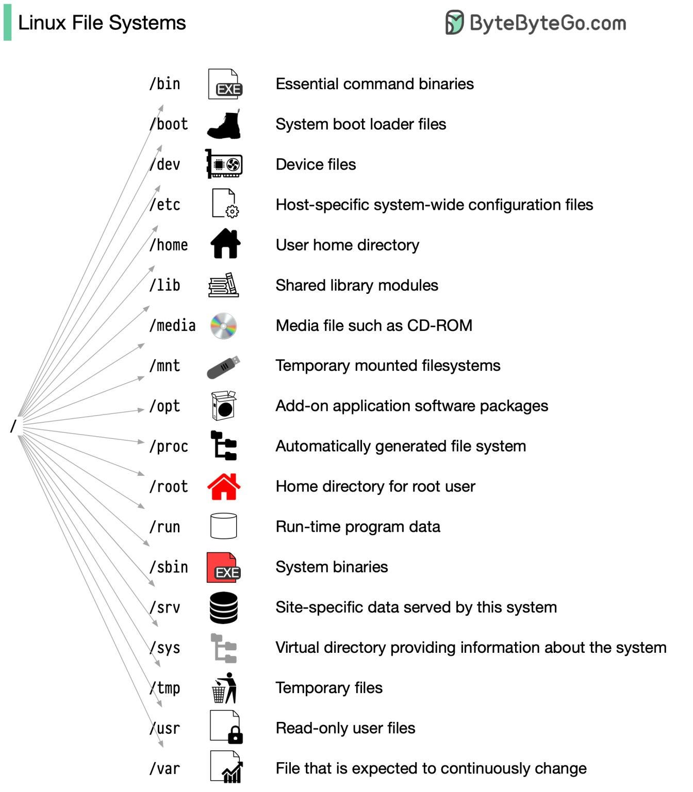
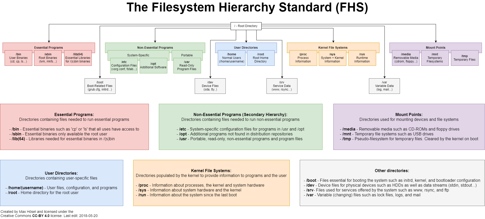

# Linux Notes

## Notes

  
 Week-1-Intro

## Tue 16 April

- Windows vs Linux
    - Windows 
        - Windows server 
        - Web server IIS - 30% GUI
        - .exe file (executable files), MSI, affected by malware easily - program or installer. 

    - Linux 
        - TUI - text user interface
        - .rpm -> redhat package manager, Red hat, Fedora, CentOS, rpm is used to distribute and install software on linux systems, it provides a standward way of packaging software and managing its dependencies with the operating system, ensuring that all necessary components are installed
- Types of OS
    - Single user - single tasking - original MS-DOS (Microsoft Disk Operating System) 
    - Single user - multi-tasking - Windows, macOS - clients
    - Multi user - multitasking - Linux, unix

- Client - Server 
    - Client - software app or computer that accesses a service made available by a server
        - request services, depend on the servers to host the services/resoures they need
    - Server - computer/system that provides resources, data services, or programs to other computers, known as computers(clients) over network
        - provide services
        - resource management
- Ports
    - 1 - 1023  - well known ports used by system-level or root processes or by programs executed by priviledged users 
    - Port 21 - File transfer protocol
    - Port 22 - SSH - secure shell for secure remote logins and file transfers
    - Port 25 - SMTP for email transmissions
    - Port 443 - HTTPS
    - 1024 - 65535 => open ports

- RHEL 
    - In a Linux environment like Red Hat Enterprise Linux (RHEL), installing and configuring specific server software allows the system to function as that type of server.
    - installing a DNS server involves setting up the BIND (Berkeley Internet Name Domain) software package, which is the most widely used DNS software on the Internet and commonly used on Linux systems. If you install BIND on a RHEL server, it can indeed function as a DNS server.
    - sudo dnf install bind bind-utils
    - The main configuration file for BIND is /etc/named.conf.
    - Define zones and zone files in the configuration to specify how DNS requests should be handled and responded to.
    - Zone files are stored in /var/named by default. These files contain DNS records for the domains that your server is authoritative for, such as SOA records, A records, MX records, etc.
    - sudo systemctl enable named
    - sudo systemctl start named
    - sudo firewall-cmd --add-service=dns --permanent
    - sudo firewall-cmd --reload
    - dig @localhost example.com

- DHCP server setup
    - install the dhcp package and configure it to allocate IP addresses to client machines within the network.
    - sudo dnf install dhcp

## Wed 17 April 

- Architectur of unix
  - hardware (Processor ALU - arithmic logical unit) <--> kernel (core component of OS) <--> shell (interpreter - convert to machine language) <--> commands (predefined programs) <--> executed by users
  - RHEL - BASH shell 

- Kernel types
    - monolithic kernel - Linux
    - micro - windows 
- Kernel manages : device info, multitasking info, file system info. 
    - Resource management - Kernel manages and allocates system resources like CPU time, memory, and disk space to various processes running on the computer
    - process management - It handles the creation, execution and termination of processes. Each command you run in Bash, for instance, results in the kernel creating and managing processes
    - device drivers - kernel includes drivers that allow it to work with different hardware devices
    - System calls - 
- Virtulisation
    - Window -> Hyper-V - Hyper-V is Microsoft's hardware virtualization product. It lets you create and run a software version of a computer, called a virtual machine. Each virtual machine acts like a complete computer, running an operating system and programs. Hyper-V runs directly on the hardware, or can be hosted in Windows, making it a Type 1 or Type 2 hypervisor depending on the configuration.
    - Linux - KVM (Kernel based virtual machine)
    - Oracle -> virtual Box
    - VMware -> workstation 

## Thurs 18 April 
- systemd
- journald
- Installation

## Fri 19 April 

- File System Hierarchy 
- 
- 
- Window
    - Mount point - there is no drive letters concept in linux 
    - Window - top level directory \  it means harddisk C:\, D:\
- Linux 
    - Without drive letters, we can identify the device
    - Use mount point
    - forward slash / is a top level directory, parent directory for all other directories
    - users
        - Admin (window) -> root (linux) - home directory for root user
        - Guest (window) -> normal (linux)\
    - / top level dir
    - /root for root user
    - /home for normal user
    - /boot - static files of the boot loader
        - GRUB2 -> RHEL 7.0, 8.0 & 9.0
        - GRUB -> RHEL 6.0
        - LILO -> 5.0, 4.0, 3.0, 2.0
    - /etc contains host specific system configuration files e.g. httpd
    - /bin  contains normal user executable commands 
    - /sbin contains super user executable commands 
    - /usr UNIX resource repositorycontains program file 
    - /opt optional for usr 
    - /var contains - /var is a standard subdirectory of the root directory in Linux and other Unix-like operating systems that contains files to which the system writes data during the course of its operation.
    - /run - real time information, media, 
    - /proc - contains background running processes (background running processes)
        - like Task Manager in window
        - #cat/proc/cpuinfo
        - #cat/proc/meminfo
    - ram, swap
    - [Linux Filesystem Hierarchy](https://tldp.org/LDP/Linux-Filesystem-Hierarchy/html/index.html)
     - https://refspecs.linuxfoundation.org/FHS_3.0/fhs/index.html

- Networking, https://www.youtube.com/playlist?list=PL7zRJGi6nMRzg0LdsR7F3olyLGoBcIvvg

